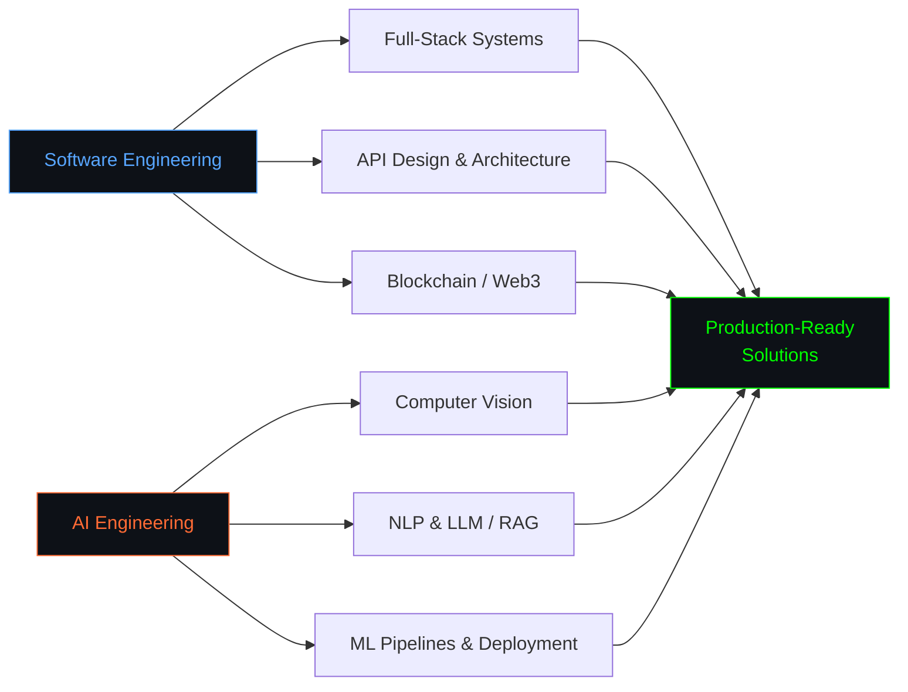
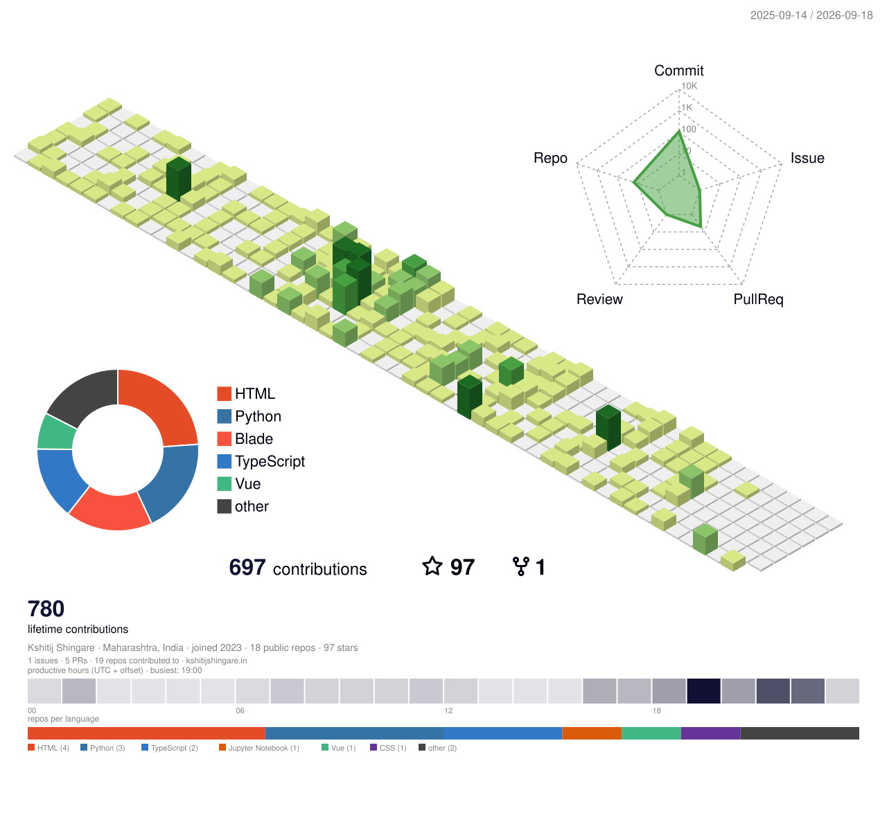

<div align="center">

<table>
<tr>
<td align="center" width="220">
  
</td>
<td align="left">

### Hey, I'm Kshitij Shingare 👋

**`AI Engineer` · `Software Engineer` · `System Architect`**

Building end-to-end systems — from scalable architectures to production ML pipelines.
I work across the full stack: designing clean APIs, deploying deep learning models,
and shipping intelligent solutions.

[](https://kshitijshingare.in)
[](https://linkedin.com/in/kshitij-shingare)
[](https://twitter.com/KBS_49)
[](mailto:kshitijshingare49@gmail.com)

</td>
</tr>
</table>

<br>


&nbsp;&nbsp;
<a href="https://github.com/kshitij-shingare?tab=followers"></a>
&nbsp;&nbsp;
<a href="https://github.com/kshitij-shingare?tab=repositories"></a>

<br><br>


</div>

<p align="center">
  
</p>

<!-- ━━━━━━━━━━━━━━━━━━━━━━━━━━━━━━━━━━━━━━━━━━━━━━━━━━━━━━━━ -->

##  About Me

<p align="center">
  <picture>
    <source media="(prefers-color-scheme: light)" srcset="https://www.gitskins.com/api/section/about?username=kshitij-shingare&theme=github-dark&mode=light" />
    
  </picture>
</p>

<div align="left">

```python
class KshitijShingare:
    def __init__(self):
        self.name = "Kshitij Shingare"
        self.role = ["AI Engineer", "Software Engineer"]
        self.education = "Information Technology — SPPU University"
        self.location = "Maharashtra, India"
        self.website = "kshitijshingare.in"

    def tech(self):
        return {
            "languages": ["Python", "TypeScript", "Go", "Java", "Solidity"],
            "ai_ml": ["TensorFlow", "PyTorch", "LangChain", "OpenCV", "YOLO", "Hugging Face"],
            "backend": ["Node.js", "FastAPI", "Spring Boot", "Express.js", "Django", "Gin"],
            "frontend": ["Next.js", "React", "Tailwind CSS", "Three.js"],
            "infra": ["Docker", "PostgreSQL", "Redis", "Firebase", "Supabase"],
        }

    def current_focus(self):
        return [
            "🔬 Building production-grade LLM/RAG pipelines",
            "🏗️ Architecting scalable distributed systems",
            "🌐 Exploring Blockchain & Web3 integrations",
            "🤖 Advancing computer vision solutions",
        ]

me = KshitijShingare()
```

```
AI Engineer and Software Engineer building end-to-end systems — from scalable
architectures to production ML pipelines. I work across the full stack: designing
clean APIs, deploying deep learning models, and shipping intelligent solutions.
```

</div>

<p align="center">
  
</p>

<!-- ━━━━━━━━━━━━━━━━━━━━━━━━━━━━━━━━━━━━━━━━━━━━━━━━━━━━━━━━ -->

##  Tech Stack

<p align="center">
  <picture>
    <source media="(prefers-color-scheme: light)" srcset="https://www.gitskins.com/api/section/stack?username=kshitij-shingare&theme=github-dark&mode=light" />
    
  </picture>
</p>

<div align="center">

#### Languages & Core


#### AI / ML / Data


#### Backend & APIs


#### Frontend & Design


#### Infrastructure & Databases


</div>

<p align="center">
  
</p>

<!-- ━━━━━━━━━━━━━━━━━━━━━━━━━━━━━━━━━━━━━━━━━━━━━━━━━━━━━━━━ -->

## 🧠 Expertise Map



<p align="center">
  
</p>

<!-- ━━━━━━━━━━━━━━━━━━━━━━━━━━━━━━━━━━━━━━━━━━━━━━━━━━━━━━━━ -->

## 🤝 Open to Collaboration

<div align="center">

<table width="100%">
<tr>
<td align="center" width="20%">
  <picture>
    <source media="(prefers-color-scheme: dark)" srcset="https://api.iconify.design/mdi/code-braces-box.svg?color=white">
    <source media="(prefers-color-scheme: light)" srcset="https://api.iconify.design/mdi/code-braces-box.svg?color=black">
    
  </picture>
  <br><br>
  <strong>Software Development</strong>
  <br><br>
  <small>
    Full-Stack Applications<br>
    API & Microservices<br>
    System Architecture
  </small>
</td>
<td align="center" width="20%">
  <picture>
    <source media="(prefers-color-scheme: dark)" srcset="https://api.iconify.design/mdi/brain.svg?color=white">
    <source media="(prefers-color-scheme: light)" srcset="https://api.iconify.design/mdi/brain.svg?color=black">
    
  </picture>
  <br><br>
  <strong>AI Development</strong>
  <br><br>
  <small>
    Computer Vision & NLP<br>
    LLM / RAG Applications<br>
    ML Pipeline Engineering
  </small>
</td>
<td align="center" width="20%">
  <picture>
    <source media="(prefers-color-scheme: dark)" srcset="https://api.iconify.design/mdi/ethereum.svg?color=white">
    <source media="(prefers-color-scheme: light)" srcset="https://api.iconify.design/mdi/ethereum.svg?color=black">
    
  </picture>
  <br><br>
  <strong>Blockchain & Web3</strong>
  <br><br>
  <small>
    Smart Contracts<br>
    Decentralized Apps<br>
    Web3 Integration
  </small>
</td>
<td align="center" width="20%">
  <picture>
    <source media="(prefers-color-scheme: dark)" srcset="https://api.iconify.design/mdi/chart-box-outline.svg?color=white">
    <source media="(prefers-color-scheme: light)" srcset="https://api.iconify.design/mdi/chart-box-outline.svg?color=black">
    
  </picture>
  <br><br>
  <strong>Data Science</strong>
  <br><br>
  <small>
    Predictive Modeling<br>
    Analytics & Visualization<br>
    Competitive DS
  </small>
</td>
<td align="center" width="20%">
  <picture>
    <source media="(prefers-color-scheme: dark)" srcset="https://api.iconify.design/mdi/open-source-initiative.svg?color=white">
    <source media="(prefers-color-scheme: light)" srcset="https://api.iconify.design/mdi/open-source-initiative.svg?color=black">
    
  </picture>
  <br><br>
  <strong>Open Source</strong>
  <br><br>
  <small>
    Community Projects<br>
    Code Review & Mentoring<br>
    Developer Tooling
  </small>
</td>
</tr>
</table>

</div>

<p align="center">
  
</p>

<!-- ━━━━━━━━━━━━━━━━━━━━━━━━━━━━━━━━━━━━━━━━━━━━━━━━━━━━━━━━ -->

## 📊 GitHub Stats

<p align="center">
  <picture>
    <source media="(prefers-color-scheme: light)" srcset="https://www.gitskins.com/api/section/stats?username=kshitij-shingare&theme=github-dark&mode=light" />
    
  </picture>
</p>

<div align="center">

<picture>
  <source media="(prefers-color-scheme: dark)" srcset="https://github-readme-activity-graph.vercel.app/graph?username=kshitij-shingare&theme=tokyo-night&hide_border=true&bg_color=0D1117&color=00D9FF&line=00D9FF&point=FF6B35"/>
  
</picture>

<br>

<picture>
  <source media="(prefers-color-scheme: dark)" srcset="https://github-readme-streak-stats.herokuapp.com/?user=kshitij-shingare&theme=tokyonight&hide_border=true&background=0D1117&stroke=00D9FF&ring=00D9FF&fire=FF6B35&currStreakLabel=00D9FF&cache_bust=5"/>
  
</picture>&nbsp;&nbsp;<picture>
  <source media="(prefers-color-scheme: dark)" srcset="https://github-readme-stats.vercel.app/api/top-langs/?username=kshitij-shingare&layout=compact&theme=tokyonight&hide_border=true&bg_color=0D1117&title_color=00D9FF&text_color=FFFFFF&langs_count=10&cache_bust=5"/>
  
</picture>

</div>

<p align="center">
  
</p>

<!-- ━━━━━━━━━━━━━━━━━━━━━━━━━━━━━━━━━━━━━━━━━━━━━━━━━━━━━━━━ -->

## 🏔️ 3D Contribution Terrain

<div align="center">

<picture>
  <source media="(prefers-color-scheme: dark)" srcset="profile-3d-contrib/profile-green-dark.svg">
  
</picture>

</div>

<p align="center">
  
</p>

<!-- ━━━━━━━━━━━━━━━━━━━━━━━━━━━━━━━━━━━━━━━━━━━━━━━━━━━━━━━━ -->

## 🤝 Connect With Me

<p align="center">
  <picture>
    <source media="(prefers-color-scheme: light)" srcset="https://www.gitskins.com/api/section/social?username=kshitij-shingare&theme=github-dark&website=kshitijshingare.in&x=KBS_49&mode=light" />
    
  </picture>
</p>

<p align="center">
  <a href="https://linkedin.com/in/kshitij-shingare"></a>&nbsp;
  <a href="mailto:kshitijshingare49@gmail.com"></a>&nbsp;
  <a href="https://twitter.com/KBS_49"></a>&nbsp;
  <a href="https://instagram.com/kshitij_shingare_49"></a>&nbsp;
  <a href="https://github.com/kshitij-shingare"></a>&nbsp;
  <a href="https://kshitijshingare.in"></a>
</p>

---

<div align="center">

> *"Building the bridge between software craftsmanship and artificial intelligence — one system at a time."*

<br>


</div>
